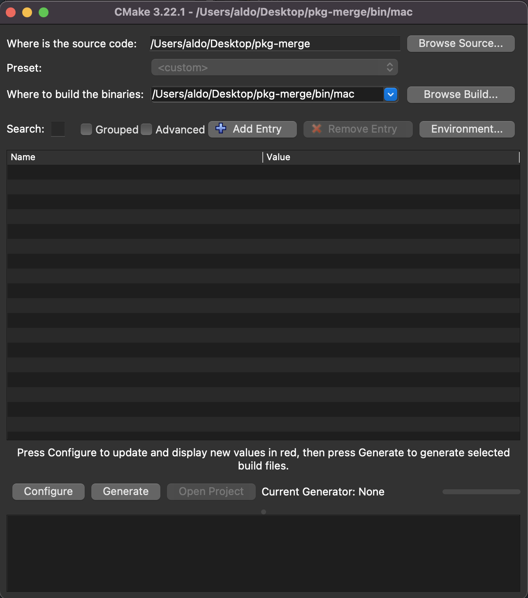
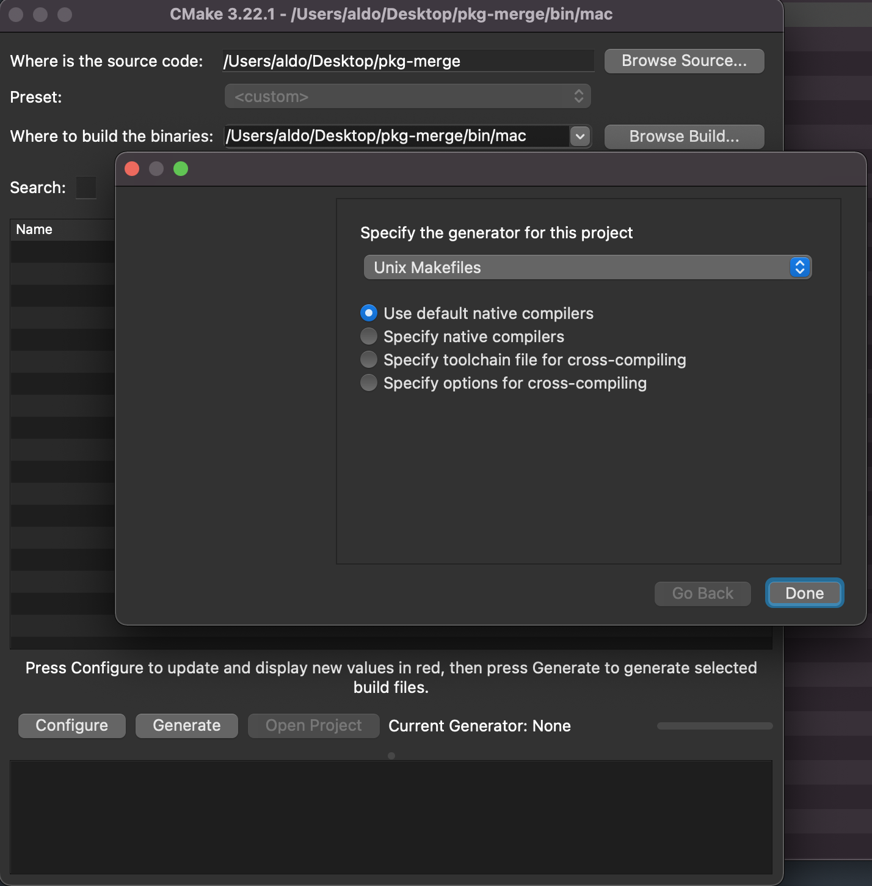
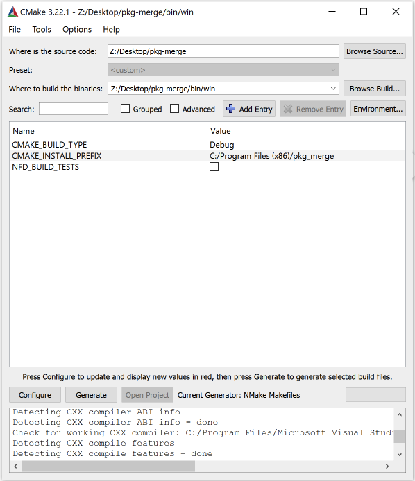

# pkg-merge
A tool to merge parts of a PS4 PKG into one entire PKG file. Useful for installing a full game on your system. Written in C++.

# Update v3.0b

- Added support for MacOS.
- No need to be in the same directory with the executable.
- When clicking on executable file, a pop-up will be shown to select the folder.
- You can also drag and drop like it used to be.

# Usage
## User-friendly
1. Download the latest release for MacOS or Windows from the [Release Page](https://github.com/aldoblack/pkg-merge/releases)
2. Extract pkg-merge.exe (Windows) / pkg-merge (MacOS).
3. Create a folder with all your PKG pieces inside.
4. Double click and select the folder.
   1. OR
5. Drag the folder of PKG files on top of the pkg-merge.exe/pkg-merge program. The merging process should begin.

## Development
1. Tools used:
   1. [Clion](https://www.jetbrains.com/clion/).
   2. [CMake GUI](https://cmake.org/). To generate Makefile
   3. CMake (cmd) to build the executable on Windows.

## How to compile
- MacOS
  - Clone the repo.
  - Download [CMake GUI](https://cmake.org/), install and open.
  - Choose project folder where `CMakeLists.txt` is located.
  - Choose destination folder.
  - 
  - Click `Generate`.
  - 
  - Click `Done`.
  - Open Terminal and go to destination folder where `Makefile` is located.
  - Type `make` and click Enter. It should be compiled successfully.

- Windows
  - Pre Requisites.
    - Visual Studio 2022.
  - Clone the repo.
  - Download Visual Studio.
  - Download [CMake GUI](https://cmake.org/).
  - Open Visual Studio.
  - Go to `Tools` -> `Command Line` -> `Developer Command Prompt` and click it.
  - On cmd Write `cmake-gui` and press Enter (Do not close cmd).
  - Choose project folder where `CMakeLists.txt` is located.
  - Choose destination folder.
  - 
  - Click `Generate`.
  - Select `NMake Makefiles` and click `Finish`.
  - From cmd, go to destination folder.
  - Type `cmake --build .`. It should be compiled successfully.

If any issue occurs with Cmake, go to `File` and delete cache.